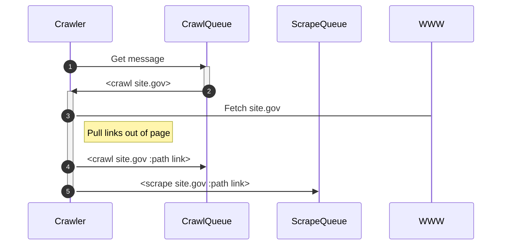
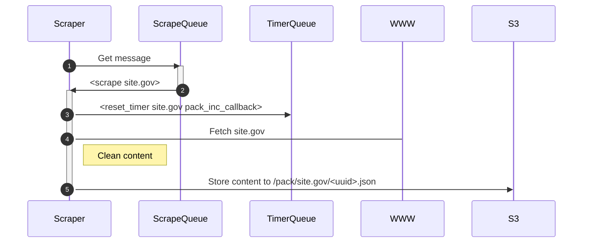
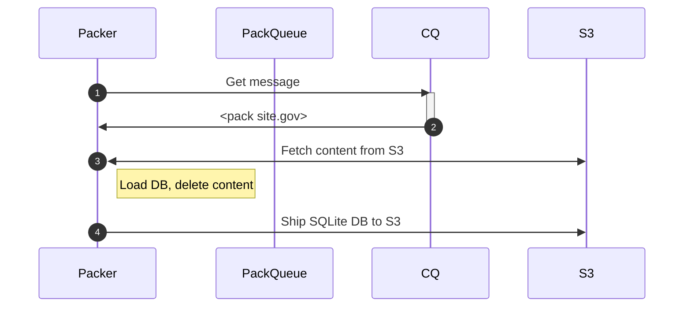

# six

*Exploration number six in SQLite-based hackery.*

"What does a distributed crawler/scraper/search engine look like?"

## I just want to run the thing

To run/build quickly/incrementally

This does a `run *.go` on the directories, instead of full container builds.

Build the base image

```
docker build -t six/dev -f Dockerfile.builder .
```

Run the stack. Individual components will be `go run *go`'d.

```
docker compose up
```


Once stood up,

```
http PUT http://localhost:8080/enqueue/CRAWL host=example.com path=/
```

will put a site on the crawler queue, which automatically triggers scraping.

```
http PUT http://localhost:8080/enqueue/PACK host=example.com type=pack_full
```

needs to be triggered manually, so that the site is packed into an SQLite database in the local S3 (minio) datastore.

Finally, 

```
http PUT http://localhost:8080/enqueue/SEARCH host=example.com type=search search-id=searcher
```

# What hath thou wrought?

While it may look a bit early 2000's, I wondered what the core of a distributed/decoupled search infrastructure might look like.

I wanted a crawler that was decoupled (via FIFO queues) from the scraper, which in turn was decoupled from the system that would turn the scraped content into a database ("packer"). And, finally, on top of this, a tiny API-driven search engine using SQLite full-text search (FTS5).

What follows is sequential, but each component is decoupled from the other, save through interactions via FIFO queues.

## Overall architecture

There is a queue server. It hosts many FIFO queues. 

Agents attempt to dequeue messages from their respective queues. They might queue messages back to their own queues, or they might queue messages to queues for other agences.

When an agent has nothing to do, they sleep.

The architecture scales easily, and as implemented, has no safeguards. For example, when Alice queues work for Bob, she has no idea if Bob ever completes the task. As a 2000-line experiment, *it works just fine*, and it exposed plenty of things to think about.

## Crawling

Life begins with a message to the `CRAWL` queue, indicating that a new host wants to be crawled. The crawler pulls the page, and extracts from it `<a href="">` content, pulling the links.

Whether to crawl a link (or not) is currently a messy affair [20241015](https://github.com/jadudm/six/blob/4a298e323fc847b56d1999bf789ea4a88db841fc/cmd/crawler/crawl.go#L31). But, it appears to stay "on-site." Because it is a crawler, it's entire job is to push messages to two places:

1. Additional links are pushed to the `CRAWL` queue, for this crawler (or another, if there are many crawlers) to pick up and continue the work, and
2. All links that are "on-site" are pushed to the `SCRAPE` queue, so that scrapers can do the work of copying content from the WWW into S3.

A cache is used for all URLs crawled, so that we don't wander around a site forever. The cache elements have a 10h TTL. In practice, this might be longer (e.g. 23h),  and there would need to be mechanisms in place for overriding the cache, and crawling (and indexing) a page regardless of whether or not the cache entry has expired.

When the `CRAWL` queue is empty, the crawler sleeps and occasionally checks the queue. 



## Scraping

Scrapers grab links off their queues, and copy content from the WWW to Amazon S3. (Locally, they copy content to a containerized [Minio](https://min.io/) instance.)

Scrapers look for messages in their queue (`SCRAPE`). Messages indicate a host and page that wants to be pulled down and turned into (somewhat) clean text.

The current scraper [grabs the text](https://github.com/jadudm/six/blob/4a298e323fc847b56d1999bf789ea4a88db841fc/cmd/scraper/scrape.go#L52) from `p`, `li`, and `td` tags. Is this everything? No. Does it matter for this experiment? No.

The text is dropped into an S3 bucket (`ephemeral-data`), named `<host>/<scrape-time>-<uuid>,json`. as a JSON object, with a bit of metadata (host, page path, etc.). If there are 500 pages in a site, there will be 500 JSON objects in the bucket. 

If we re-scrape a site before packing it for search, then the objects are overwritten. This only happens if we queue the scraping of a single site twice in short succession. If multiple scrapers are all reading off the same queue, they can safely put content in the bucket in parallel without stepping on each-other's toes.

Not implemented, but envisioned: every time we scrape a page, we should drop a message to the `TIMER` queue. (This could mean a lot of traffic on the queue; perhaps it should be per-host rather than per-page.) Specifically, it either schedules a callback message to be fired at some later point in time. The `timer` process handles sending these messages later (see below).



## packing

In many systems, there is a live database server. In this system, there are SQLite database files. They live in S3, and are (when we want to serve them), pulled onto a host for use in search, analytics, or they might be indexed and processed further. 



The packer has the job, in this prototype, of transforming the scraper's JSON documents into an SQLite database. A scraper looks to the `PACK` queue for its messages. When it receives one, it is either a `pack_full` or `pack_incremental` call (only `pack_full` is implemented).

(FIXME: there is a potential race if multiple packers are handling incremental messages. This might require some kind of "claim"... e.g. a packer might need a way to dequeue a message and have the queue server atomically insert a claim at the same time, preventing other packers from trampling their work. :thinking-face:)

Once a message is received, the packer 

1. Looks into S3 for JSON objects under the host's directory,
2. Extracts each one in turn, and
3. Inserts it into an SQLite database.

When it has processed all of the JSON documents, it deletes them, and inserts the SQLite database back into S3 in the `database-storage` bucket. 

In the case of an  incremental pack, it would retrieve the database file, process one or more JSON documents (UPSERTing them into the database), and then return the database to the S3 bucket.

## timer

Not implemented is the `timer`. 

The timer is one way to prevent a packer from building the database before the scrapers are done. 

Imagine a scraper posting a message to the timer saying "hey, pack this site in 5 minutes," If the timer has never seen that site, it starts a timer. Every time any scraper sees a page from that same site, they post a message for the timer. Because the clock is already ticking for that site, the timer... just resets the clock.

When scrapers are all done, the timer will have a chance to run out. When it does, the message is posted to the correct queue (probably `PACK`), and work continues.

## searcher

Searchers have IDs, and it is imagined that there would be a search orchestrator. The orchestrator would watch the queue for `SEARCH` messages, and decide which search server should take responsibility for serving the content. The orchestrator might also handle all search queries (or, a separate, load-balanced `router`), and route them to the correct search server.

Each search server would, when messaged, copy the relevant database from S3 to its local disk. From that point forward, it would be ready to serve search queues on the content.

The current implementation assumes no orchestrator; instead, a searcher comes alive, looks at the S3 databases, and solves the [knapsack problem](). This means they look to see how many databases can fit in (say) 50MB, and all of those databases are copied over.

An orchestrator would make sure that databases are spread out, possibly balanced based on traffic and other considerations, and ultiamtely be a meta-loadbalancer. 

For now, the searchers do two things:

1. Serve a search page at `http://localhost:8484/static/` via GET, and
2. Serve a single API call at `http://localhost:8484/<host>` via POST, where the host queried is determined by the URL parameter.

The page uses the API. Queries are single strings, interpreted as [SQLite FTS5 queries](https://www.sqlite.org/fts5.html#:~:text=3.7.%20FTS5%20Boolean%20Operators). Snippets are returned, highlighting relevant terms.

# Will it blend?

Once stood up,

```
http PUT http://localhost:8080/enqueue/CRAWL host=example.com path=/
```

will put a site on the crawler queue, which automatically triggers scraping.

```
http PUT http://localhost:8080/enqueue/PACK host=example.com type=pack_full
```

needs to be triggered manually, so that the site is packed into an SQLite database in the local S3 (minio) datastore.

Finally, 

```
http PUT http://localhost:8080/enqueue/SEARCH host=example.com type=search search-id=searcher
```

tells the one scraper to copy content in.

At that point, 

[http://localhost:8484/static/](http://lozcalhost:8484/static/)

will serve up search results for `example.com`.

It will blend. I don't know if I'd build an enterprise-grade system on queues. They're hard to monitor, they're hard to recover... but they're really appealing from a scaling perspective. That is... if you need 16 crawlers, you just need them all pulling jobs off one queue. 

# Other build notes

To run/build statically (meaning, each container contains a full binary build, and executes those)...

```
docker compose -f compose.exe.yaml up --build
```


# Project size

```
six$ docker run --rm -v $PWD:/tmp aldanial/cloc --exclude-dir=static .
github.com/AlDanial/cloc v 2.02  T=0.01 s (5261.0 files/s, 284802.8 lines/s)


-------------------------------------------------------------------------------
Language                     files          blank        comment           code
-------------------------------------------------------------------------------
Go                              37            407            251           2066
JSON                             5              0              0            595
YAML                             4             14             50            305
Markdown                         5            104              0            287
Text                             1              0              0            127
make                            11             27              2             96
Bourne Shell                    11             35            125             75
Dockerfile                       5             24             24             39
SQL                              3             10             11             29
Ruby                             1              6              0             24
-------------------------------------------------------------------------------
SUM:                            83            627            463           3643
-------------------------------------------------------------------------------
```