# message types

## common keys

All messages MUST contain a "type" key. Its value is a string in a controlled vocabulary.

Valid values for "type" are:

* `index+crawl`: index a page and store the content to S3 (`/content/<domain>/<page>.json`), and crawl links, adding links in the allowed domains back to the `HEAD` queue.
* `index`: index the page (storing content to S3), but do not crawl links.
* `crawl`: crawl the page for links, and post `index` and `crawl` messages for each link found.
* `pack_incremental` and `pack_full` trigger SQLite database creation.

## initiating an index/crawl

A client posts to the queue that site.gov wants to start crawling a site. 

This gets posted to the `INDEX` queue.

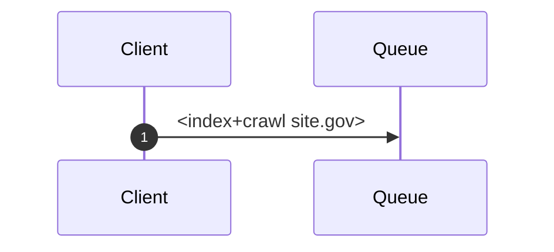

## indexers

Indexers pick up two kinds of messages: `index` and `index+crawl` messages.

The indexer is responsible for fetching the content, converting it to text, and caching that text in S3. Every time an indexer receives a page, it queues a message to reset the timer on this site. When the site settles down for <timeout> minutes, we will queue a database update.

Ultimately, a Packer is responsible for turning the cached S3 data into an SQLite database.

### `index+crawl`

When an `index+crawl` message is found, it is unpacked into two messages, `index` and `crawl`, respectively. An indexer/crawler will then pick up the respective messages. It also starts a timer, queueing a `pack_full` callback when the work is done.

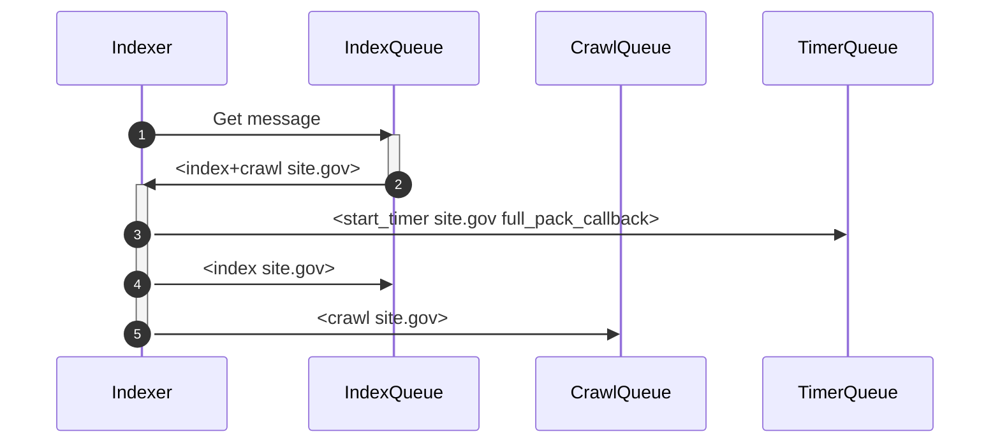

### `index`

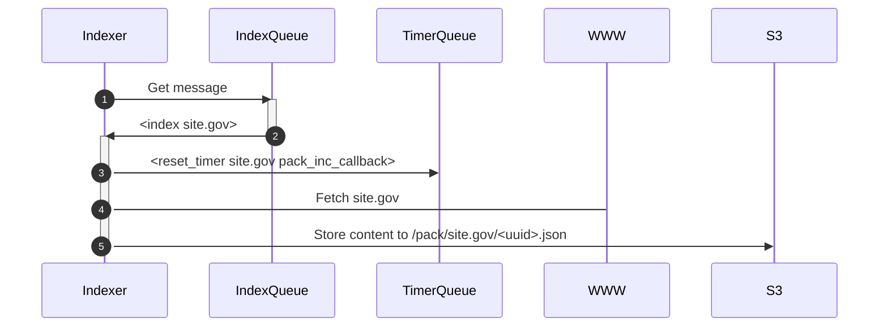

When indexing, we issue a timer reset, to let the packers know we're not done. It is up to the Timer to know that if the timer *does not* exist, we should start one, and have an incremental message queued; that is, the client may have asked for just one page to be re-indexed. If the timer *does* exist, then we just tickle the timer, but leave the queued message alone.

## crawlers

Crawlers fetch content (typically HTML) and look for links. Any links found that are in the domain are queued for indexing and crawling at that path.

We assume, when crawling, that we are also indexing; there is no point in crawling *without* indexing, as that would just be traversing the site (without storing/building an index).

Crawling does not queue updates to the timer. We let the indexer do that. (We *could* add timer tickling to the crawler, but it seems redundant.)

### `crawl`

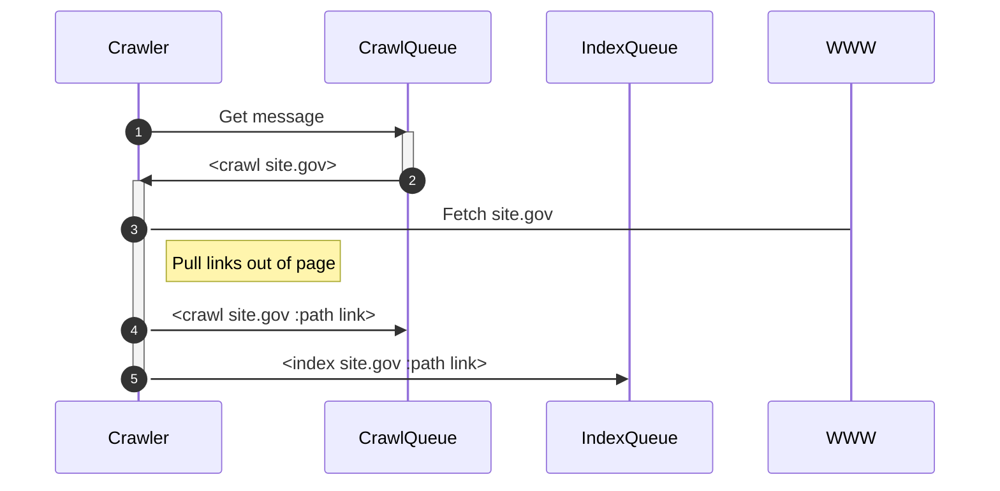

## timer

When indexing/crawling, we have a lot of asynchronous work to do. In doing that work, we want to have timers that we can:

1. Start, registering the timeout and a callback message
2. Restart, so that we get more time on the clock

When the timer runs out, we want to post the callback message to the queue.

To start a timer on a domain, we use a `start_timer` message.

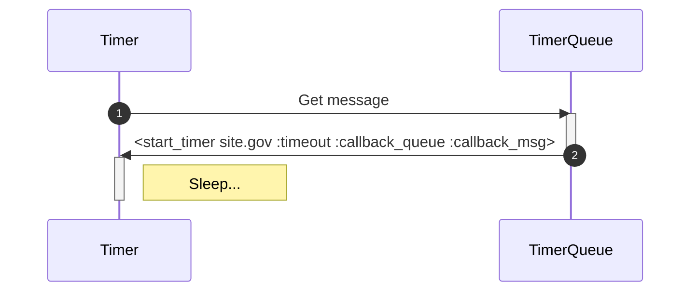

The timer periodically checks the queue for messages, like all clients in the queued model. A reset message causes the associated timer to reset to the stored `:timeout` value.

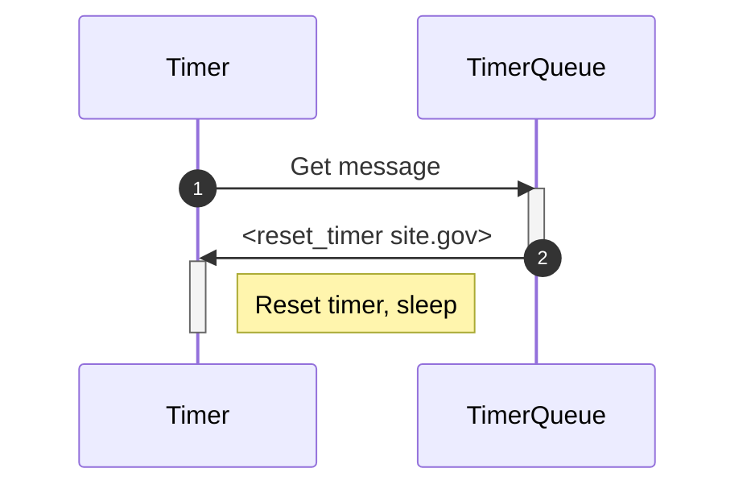

When a timer fires, we proceed to post the stored message to the appropriate queue.

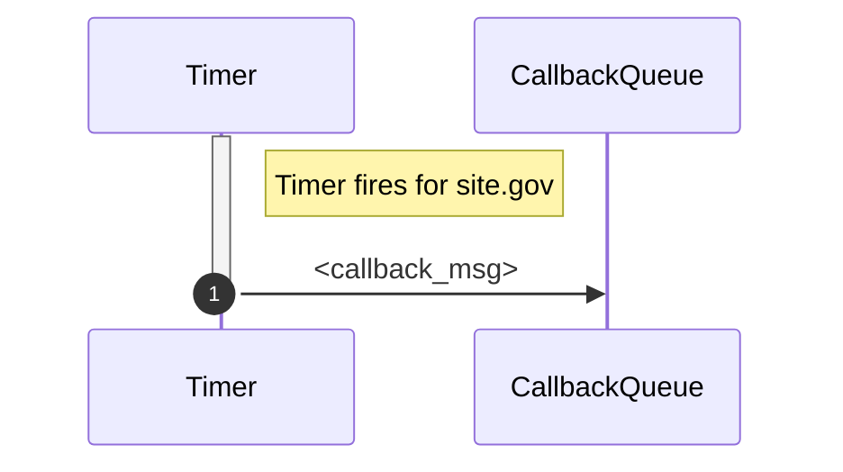

A typical use pattern would be to start a timer when indexing begins on a site, with some reasonable timeout (e.g. 5m) and a callback message for the packers (e.g. `incremental_end` or `full_end`). The callback would be used to indicate that we should pull the cached content from S3, pack it into an SQLite file, and alert the searchers that they need to update their local database from S3.

## packer 

A packer takes cached conetent from S3 and turns it into an SQLite database. Because we have many indexers and crawlers, and our databases are *local*, we have to pack the database as a single operation. So, the packers take responsibility for converting cached information into a single database file.

We will either `pack_incremental` or `pack_full`. 

### `pack_incremental`

In an incremental pack, we expect an SQLite database to already exist. The loading of content will essentially be an `UPSERT`, updating existing records, and creating new records as needed.

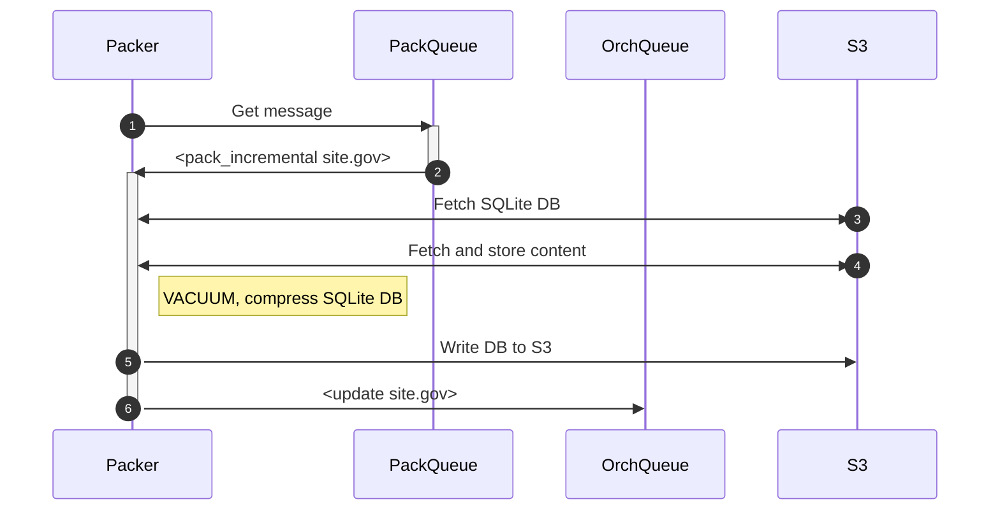

### `pack_full`

In a `full` pack, we create a new database and load it with the content. When done, we overwrite the SQLite database in S3, because we assume we just did a full refresh/full walk of the domain.

The last act of the packer is to post that the database has been updated, so that the search orchestrator can refresh their local DB.

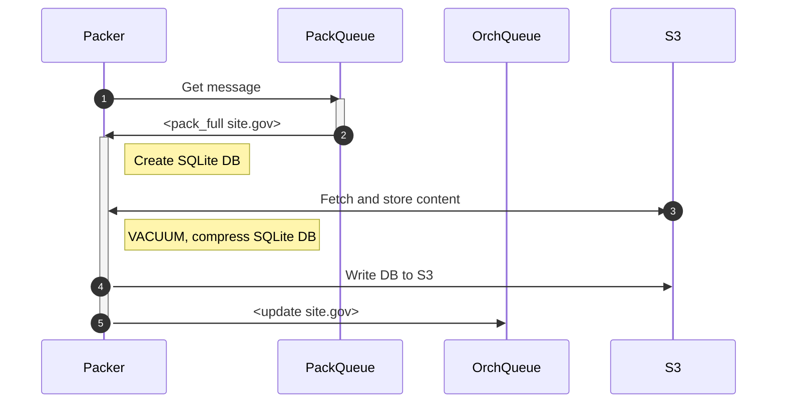

## orchestrator

The search orchestrator is a router for search messages. It keeps track of which databases are on which searchers. In other words, it is a stateful component that knows where things are.

In the case of a cold bring-up, everything gets rebuilt. The orchestrator is responsible for (at startup) discovering what databases are in S3, handling searcher registrations, and distributing DBs to those searchers. Just like a "living" database (Postgres, Elasticsearch, etc.) we assume the databases survive restart; we assume the application does not. Therefore, the state that the orchestrator maintains does not get persisted.

The Orchestrator handles a number of different message types.

### `register`

As searchers come alive, they post `register` messages into the queue to let the orchestrator know they are ready to receive databases. They post how much free space they have in MB, rounding down.

They provide a UUID, because we will need to (later) send messages through the queue to specific searchers. For example, we might want to move a DB. This entails telling one searcher to delete their DB, while telling another to load the DB. Doing this in a distributed manner means someone, somewhere needs to know what is going on in-the-moment.

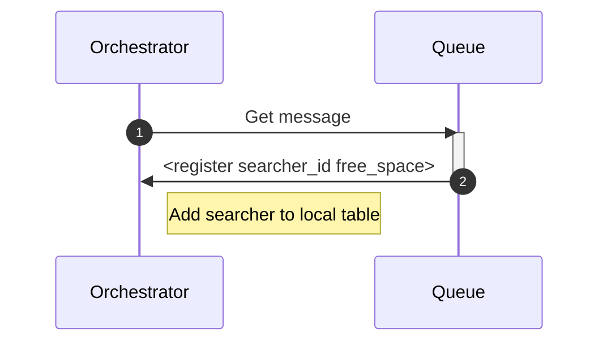

## searcher

Searchers come up and want to handle queries. To do that, they need a database. So, they register with the orchestrator.

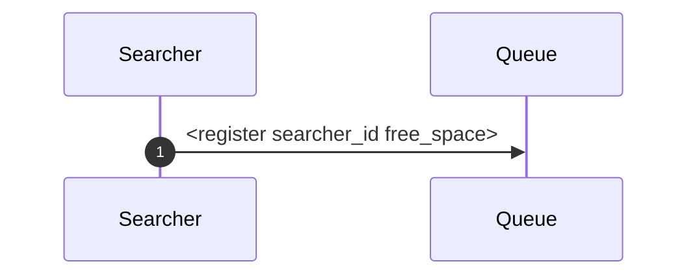

The orchestrator will issue a DB.

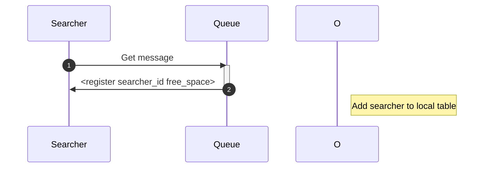